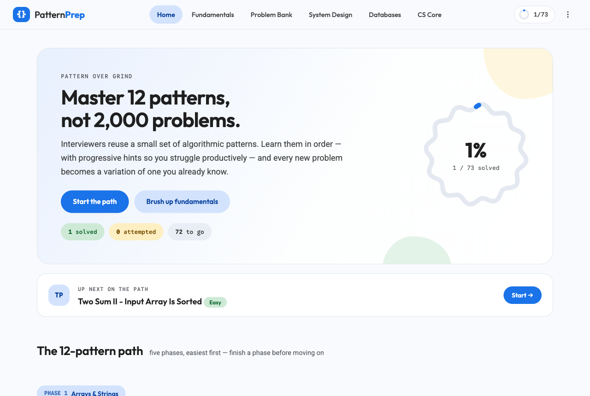
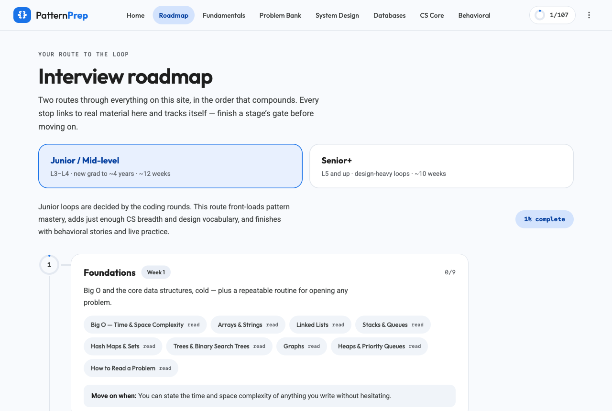
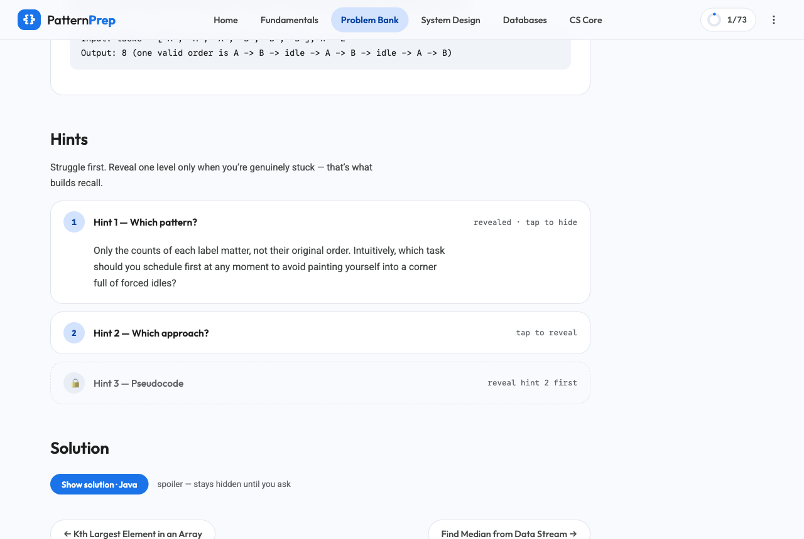

<div align="center">

# PatternPrep

**Master 18 patterns, not 2,000 problems.**

A fully static FAANG interview prep platform — pattern-first problem bank, progressive hints,
system design, behavioral prep, and guided roadmaps. No backend, no build step, no account.




</div>

---

## Why

Most candidates brute-force LeetCode: hundreds of random problems, little retention. Interviewers,
meanwhile, reuse a small set of algorithmic patterns. PatternPrep organizes preparation around
those patterns — learn one, and every new problem in that family becomes a variation of something
you already know. Hints are deliberately progressive (pattern → approach → pseudocode) so you
struggle productively instead of flipping straight to solutions.

## Features

### 🗺️ Guided roadmaps
Two connected routes through everything on the site, each stage linking to real material with live
progress and a concrete *"move on when"* gate:

| Route | Target | Length | Emphasis |
|---|---|---|---|
| **Junior / Mid** | L3–L4 | ~12 weeks | Coding rounds first; CS breadth; design vocabulary |
| **Senior+** | L5+ | ~10 weeks | Hard-first patterns; 3 weeks of system design; leadership narrative |



### 🧩 Pattern-first problem bank — 107 problems, 18 patterns, 6 phases
Two Pointers · Sliding Window · Prefix Sums · Intervals · Fast & Slow Pointers · Linked List
Reversal · Binary Search · Monotonic Stack · Heaps/Top-K · Trees BFS/DFS · Tries · Graphs ·
Union-Find · Greedy · Bit Manipulation · Backtracking · Dynamic Programming · Advanced DP
(knapsack, tree, state-machine, and interval DP).

Every problem ships with:
- a statement with worked example and difficulty tag (Easy / Medium / Hard / Super Hard),
- **three progressive hints** that unlock one level at a time — no accidental spoilers,
- a **Java solution** (syntax-highlighted, collapsed by default) with approach explanation and
  time/space complexity.



### 📚 Beyond the algorithms
- **DSA Fundamentals** — Big O, core data structures, and a 6-step protocol for reading problems.
- **System Design** — scalability, load balancing, caching, SQL vs NoSQL, message queues, CAP —
  plus step-by-step walkthroughs of a URL shortener, rate limiter, and news feed.
- **Databases & SQL** — joins, indexing, normalization, transactions, and classic interview queries.
- **CS Fundamentals** — OSI model, TCP vs UDP, "what happens when you type a URL", processes vs
  threads, concurrency, memory & GC.
- **Behavioral** — the STAR framework with a worked answer, the story-bank matrix, **all 16 Amazon
  Leadership Principles**, Google/Meta signal breakdowns, senior-scope storytelling, and questions
  to ask back.

### 📈 Progress that stays yours
Solved/attempted status, hint reveals, and topic read-state are stored in `localStorage` — no
account, no server, nothing leaves your browser. Export a JSON backup any time (⋮ menu) and import
it on any machine. Clearing site data resets progress, so keep a backup.

## Quick start

```sh
git clone https://github.com/msiShariful/PatternPrep.git
cd PatternPrep
python3 -m http.server 8000   # any static server works
# open http://localhost:8000
```

No install, no build — opening `index.html` directly in a browser also works.

## Tech

Deliberately boring: semantic HTML, modern CSS (custom properties, grid), and framework-free
JavaScript. Hash-based routing, a ~60-line dependency-free syntax highlighter, and SVG progress
rings drawn at runtime. The entire site is static files — host it on GitHub Pages, Netlify, or a
USB stick.

```
index.html          shell — top app bar, drawer, script tags
css/style.css       design system (Material 3 Expressive, tokens at top)
js/app.js           router + all views
js/storage.js       localStorage progress, export/import
js/highlight.js     Java/SQL highlighter
js/data/            all content as plain JS data files
```

## Contributing

Content additions (problems, topics) are plain data files — see the schemas in
[`CLAUDE.md`](CLAUDE.md) and follow the existing format. Keep the invariants: hints unlock
progressively, solutions stay collapsed by default, and zero dependencies.

## License

[MIT](LICENSE) © 2026 Shariful Islam
